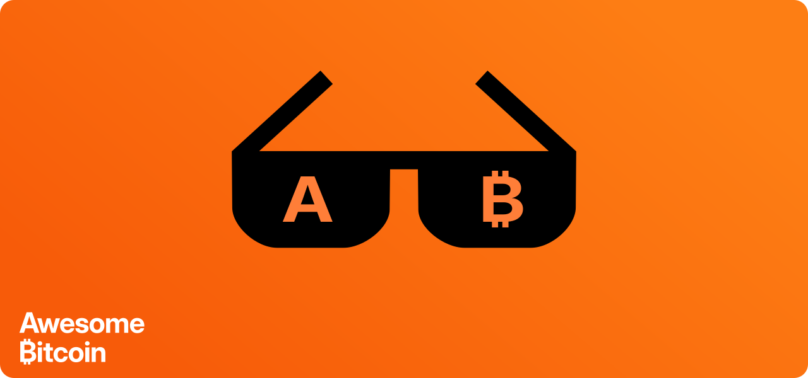

# Awesome ₿itcoin

A community-driven collection of awesome open-source projects and resources that make Bitcoin even more... awesome!

Content
---
 - [Books](#books)
 - [Communities](#communities)
 - [Education](#education)
 - [History](#history)
 - [People](#people)
 - [Software](#software)
 - [Talks](#talks)
 - [Wallets](#wallets)
 - [Websites](#websites)

---

Books
---
_Books to read on Bitcoin_
 - [Mastering Bitcoin](https://github.com/bitcoinbook/bitcoinbook)

Communities
---
_Bitcoin only communities and groups_
 - [Awesome Bitcoin](https://t.me/AwesomeBitcoin) 
 - [Bitcoin Knots - Community Forum](https://bitcoinknotsforum.com)
 - [Bitcoin Knots - Telegram](https://t.me/Bitcoin_Knots)

Education
---
_Educational resources on Bitcoin_
 - [Bitcoin Wiki](https://en.bitcoin.it)

History
---
_Historical events in Bitcoin's history_
 - [Bitcoin White Paper 1](https://bitcoin.org/en/bitcoin-paper) | [2](https://nakamotoinstitute.org/library/bitcoin/)

People
---
_Honorable mentions_
 - [Adam Back](https://en.wikipedia.org/wiki/Adam_Back)
 - [Luke Dashjr](https://en.wikipedia.org/wiki/Luke_Dashjr)
 - [Satoshi Nakomoto](https://en.wikipedia.org/wiki/Satoshi_Nakamoto)

Software
---
_Open-source Bitcoin applications_
 - [Bitcoin Core](https://bitcoin.org/en/bitcoin-core)
 - [Bitcoin Knots](https://bitcoinknots.org)
 - [Parmanode](https://github.com/armantheparman/parmanode)

Talks
---
_Talks & Poscasts on Bitcoin_
 - [Bitcoin Core Dev mailing-list](https://groups.google.com/g/bitcoindev)

Wallets
---
*Open-source Bitcoin only wallets*
 - [Cold Card](https://coldcard.com)
 - [Electrum](https://electrum.org)
 - [Sparrow](https://www.sparrowwallet.com)

Websites
---
_Websites related to Bitcoin_
 - [Bitnodes.io](https://bitnodes.io)
 - [Clark Moody Bitcoin Dashboard](https://dashboard.clarkmoody.com)
 - [Mempool.guide](https://mempool.guide)

 ---

 *Inspired by the [awesome](https://github.com/sindresorhus/awesome) list thing. You might want to read the complete [awesome](https://github.com/sindresorhus/awesome) list.*

### Contributing
Kindly go through [Contribution Guidelines]() first.
